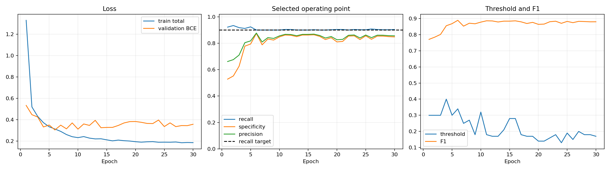

# 可见水印初筛模型推理项目

## 1. 项目用途与边界

本项目基于 MobileNetV3-Large 微调实现对图像初步是水印判别，对输入图像执行可见水印**初步筛选**。输出表示“该图像是否为潜在水印图像”，不是严格、最终的水印判定。

被本模型筛选为水印候选的图像，后续仍须送入 OBB 水印目标识别模型，由 OBB 模型最终确认：

- 是否确实存在水印；
- 水印数量；
- 每个水印的位置和方向框。

本模型使用合成水印数据训练。真实图像的水印样式、透明度、压缩、缩放、截图噪声和拍摄链路可能与训练数据存在域差异，因此在真实数据上仍可能出现漏检或误检，不应把初筛结果直接作为业务最终结论。

## 2. 目录结构

```text
Detect/
├── config/
│   └── config.yaml                    # 推理、预处理、测试和导出配置
├── test/
│   ├── *.png                          # 随项目交付的测试图像
│   └── result.json                    # 测试汇总结果
├── trainResult/
│   ├── training_history.csv           # 30 个训练周期的原始指标
│   └── training_curves.png            # 训练指标可视化
├── weights/
│   ├── mobilenet_v3_large.pt           # PyTorch V3 权重
│   └── onnx/                           # ONNX 导出文件及元数据
├── model.py                            # 模型定义与 PT 权重加载
├── preprocess.py                       # 原始尺度滑窗与归一化
├── pipeline.py                         # 单图、文件夹和测试推理接口
├── test_pipeline.py                    # 一键执行 test 测试
├── export_onnx.py                      # FP16、FP8、INT8 ONNX 转换
├── settings.py                         # YAML 配置读取与校验
└── requirements.txt
```

项目没有附带开源许可证。上传公开仓库前，应由项目所有者补充合适的 `LICENSE`，并确认训练数据、测试图像和权重具备对应的分发权限。较大的 `.pt`、`.onnx` 文件建议通过 Git LFS 管理，仓库已经提供相应的 `.gitattributes` 规则。

## 3. 环境安装

当前项目已验证，核心版本为 PyTorch 2.13、TorchVision 0.28、ONNX 1.22 和 ONNX Runtime 1.29。

```powershell
python -m pip install -r requirements.txt
```

如需使用 CUDA，请安装与目标 CUDA 环境匹配的 PyTorch；仅做 CPU 或移动端 ONNX 推理时不要求 CUDA。

## 4. 模型输入与输出

### 4.1 输入

PyTorch/ONNX 模型本体接收：

- 张量名称：`images`；
- 形状：`[N, 3, 320, 320]`；
- 通道顺序：RGB；
- 数据类型：FP32 输入；
- 数值处理：先除以 255，再使用 ImageNet mean/std 归一化。

其中 `N` 是一次送入模型的滑窗数量。ONNX 只包含分类模型，不包含图像解码、滑窗切分、归一化和整图结果聚合；移动端需要复现第 5 节的流程。

### 4.2 输出

模型本体输出：

- 张量名称：`logits`；
- 形状：`[N]`；
- 含义：每个 320 × 320 滑窗的未归一化分类 logit。

Pipeline 对每个 logit 执行 sigmoid，得到滑窗水印概率，再以整张图所有滑窗概率的最大值作为图像概率：

```text
image_probability = max(sigmoid(tile_logits))
is_watermark = image_probability >= threshold
```

使用最大值聚合是为了优先保证召回：只要任一局部区域呈现水印特征，整图即进入后续 OBB 检查阶段。

## 5. 输入预处理

预处理与 V3 训练策略保持一致，不把任意比例图像强制缩放为 320 × 320：

1. 读取图像并根据 EXIF 修正方向，统一转换为 RGB。
2. 当宽或高超过 320 像素时，按原始分辨率执行 320 × 320 滑窗，默认步长为 240，即相邻窗口重叠 80 像素。
3. 每个方向最后一个窗口强制贴合图像末端，避免右边缘和下边缘遗漏。
4. 当图像宽或高不足 320 像素时，不放大、不拉伸，仅在右侧和底部补黑至 320 × 320。
5. 像素转换为 `[0, 1]`，随后按 ImageNet 参数归一化：mean 为 `[0.485, 0.456, 0.406]`，std 为 `[0.229, 0.224, 0.225]`。

这种处理能保留半透明水印在原始尺度下的局部纹理，但大图会产生更多滑窗，推理耗时与图像面积近似正相关。

## 6. 输出后处理与阈值

推荐阈值为 **0.2-0.4** 之间，配置位置为 `config/config.yaml` 中的 `inference.threshold`。配置文件中的值优先于权重检查点内记录的历史阈值。

- 阈值越高，判别越严格，误报通常减少，但可能增加漏检；
- 阈值越低，判别越宽松，召回率通常提高，但精度下降、更多图像会进入 OBB 阶段；
- 当前任务不能接受漏检时，可在独立真实验证集上尝试低于 0.3 的阈值，并结合 OBB 阶段的吞吐压力确定最终工作点。

阈值需要按实际业务数据重新标定，不能仅根据合成验证集决定，考虑到当前模型仅作初筛，阈值应尽可能低，确保**召回率优先**。

## 7. 配置文件

全部推理配置从 `config/config.yaml` 读取，包括：权重路径、设备、滑窗大小、步长、归一化参数、判别阈值、滑窗批大小、测试输入输出路径以及 ONNX 导出参数。相对路径均相对于 `config.yaml` 所在目录解析。

常用配置：

```yaml
model:
  weights: ../weights/mobilenet_v3_large.pt
  device: auto

preprocess:
  tile_size: 320
  stride: 240

inference:
  threshold: 0.30
  tile_batch_size: 64
```

`device: auto` 会优先使用 CUDA，否则使用 CPU。显存不足时可减小 `tile_batch_size`。

## 8. 推理用法

### 8.1 命令行

不传输入路径时，按 YAML 的 `test.input` 和 `test.result` 执行内置测试：

```powershell
python pipeline.py
```

输入单张图像：

```powershell
python pipeline.py --input D:\images\example.jpg --output D:\images\result.json
```

输入文件夹：

```powershell
python pipeline.py --input D:\images --output D:\images\result.json
```

也可以执行测试入口：

```powershell
python test_pipeline.py
```

### 8.2 Python 接口

```python
from pipeline import DetectionPipeline

detector = DetectionPipeline("config/config.yaml")

# 单图：返回DetectionResult
one = detector.infer_file("D:/images/example.jpg")
print(one.has_watermark, one.probability)

# 文件夹：返回DetectionResult列表
many = detector.infer_directory("D:/images")

# 自动判断单图/文件夹，并将结果写入JSON；返回结果列表
results = detector.run("D:/images", "D:/images/result.json")

# 使用config.yaml中的test路径；返回结果列表
test_results = detector.test()
```

`result.json` 的每条记录包含图像路径、是否为水印候选、图像概率、阈值、原始尺寸、滑窗数量、最高分滑窗坐标、耗时和错误信息。文件顶层还包含模型、权重、汇总数量和运行配置。

## 9. 测试集与当前测试结果

`test` 文件夹包含 15 张随项目交付的测试图像。执行 `python test_pipeline.py` 后，会覆盖生成 `test/result.json`。

当前使用 `mobilenet_v3_large.pt`、阈值 0.3 的结果为：

- 总图像数：15；
- 水印候选：9；
- 非水印候选：6；
- 读取/推理错误：0。

该测试目录没有独立真值标签，因此以上数字只是输出分布和流程验收结果，不代表准确率、召回率或特异性。

## 10. 权重文件

`weights/mobilenet_v3_large.pt` 是 DetectV3 的 MobileNetV3-Large PyTorch 检查点，包含模型结构标识、模型参数、训练周期和训练/验证元数据。当前文件记录的训练周期为第 30 周期。Pipeline 以严格模式加载 `model_state_dict`，结构不匹配时直接报错，避免静默使用错误权重。

`weights/onnx` 中的导出物包括：

- `mobilenet_v3_large_fp32.onnx`：FP32 基准模型；
- `mobilenet_v3_large_fp16.onnx`：FP16 内部计算，保留 FP32 输入输出；
- `mobilenet_v3_large_fp8.onnx`：E4M3FN 逐输出通道权重存储，图内恢复为 FP32 计算；
- `mobilenet_v3_large_int8.onnx`：使用 `test` 图像滑窗校准的静态 QDQ INT8 模型；
- 同名 `.json`：每个模型的哈希、输入输出、来源权重和数值校验结果；
- `export_summary.json`：全部导出物汇总。

当前导出大小约为 FP32 16.03 MiB、FP16 8.05 MiB、FP8 4.18 MiB、INT8 4.51 MiB。FP32、FP16、INT8 已通过当前 ONNX Runtime 的导出后数值校验；FP8 可以通过 ONNX 结构检查并运行，但当前样本 logit 误差未通过配置门限，因此属于实验格式，部署前必须在目标设备和真实验证集上重新验证。

FP8 在不同移动端推理框架中的算子支持差异较大；此文件主要压缩权重存储，并不等同于原生 FP8 加速。INT8 校准目前使用交付测试图像，仅用于演示完整转换流程。正式发布应把 `export.calibration_input` 指向具有代表性、合规且不参与最终测试的真实校准集，再重新导出并评估召回率。

## 11. ONNX 转换

```powershell
python export_onnx.py --config config/config.yaml
```

转换流程会：

1. 从 YAML 指定的 PT 权重重建 MobileNetV3-Large；
2. 导出 FP32 基准 ONNX；
3. 由基准模型生成 FP16、FP8 权重存储和静态 INT8 QDQ 版本；
4. 执行 ONNX 结构检查和 ONNX Runtime 数值比较；
5. 在 `weights/onnx` 写入模型、逐模型元数据和汇总文件。

不同手机芯片和移动推理框架支持的量化格式不同。上线前需要在实际 NNAPI、Core ML、ONNX Runtime Mobile 或厂商 NPU 后端上测试算子兼容性、端到端延迟、内存占用以及图像级召回率。移动端还必须在模型外实现完全相同的滑窗、补边、归一化、sigmoid、最大值聚合和阈值判定。

## 12. 训练结果说明

`trainResult/training_history.csv` 保存 30 个周期的训练和验证指标。核心趋势如下：

- 总训练损失从 1.3311 降至 0.1863，最低 0.1855（第 28 周期）；
- 图像级训练损失从 0.5903 降至 0.0046；
- 难负样本损失从 0.4380 降至 0.0003；
- 排序损失在第 5 周期降至 0；
- 辅助损失从 0.7264 降至 0.3632；
- 验证损失最低为 0.3052（第 6 周期）；
- 第 6 周期同时取得最高验证 F1 约 0.8885、准确率约 0.887、召回率 0.900、特异性 0.874，对应当周期选择阈值 0.34；
- 第 30 周期验证损失为 0.3583，记录阈值 0.17、召回率 0.904、特异性 0.848、准确率 0.876、F1 约 0.8794。

后期训练损失继续下降而验证集未同步改善，说明存在一定训练/验证泛化差距。部署配置采用推荐阈值 0.3，而不是照搬某一训练周期自动选择的阈值，并且仍需以真实业务验证集重新标定。



## 13. 上线前检查清单

- 单独覆盖低透明度、小水印、多水印、时间戳、平台角标、复杂文字背景和不同压缩质量；
- 依据“漏检优先”目标重新选择阈值，不以 accuracy 单指标决策；
- 在目标手机上复现原始尺度滑窗，并测量超大图批量处理的耗时与峰值内存；
- 对 FP16/FP8/INT8 分别做端到端回归测试，不能只验证模型能被加载；
- 保留 OBB 二阶段确认，避免把初筛误报直接作为最终水印结论。
