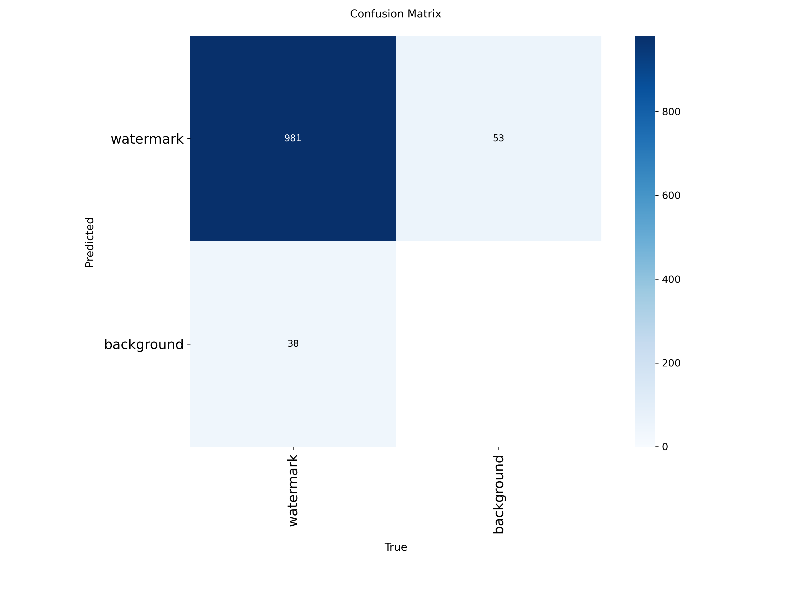
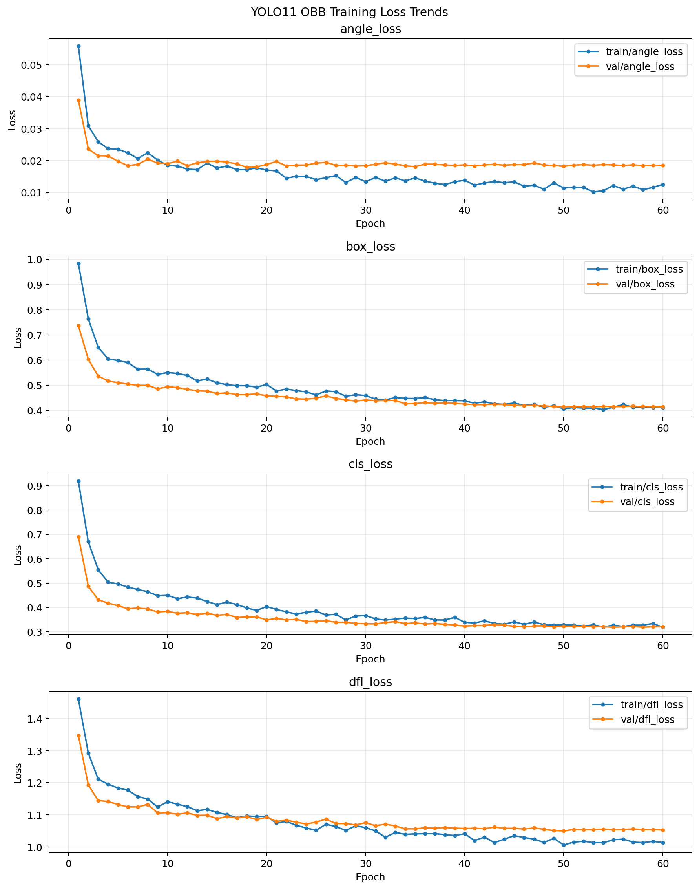
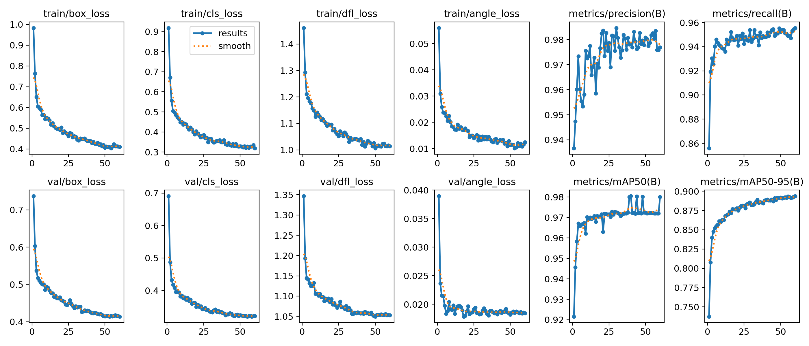
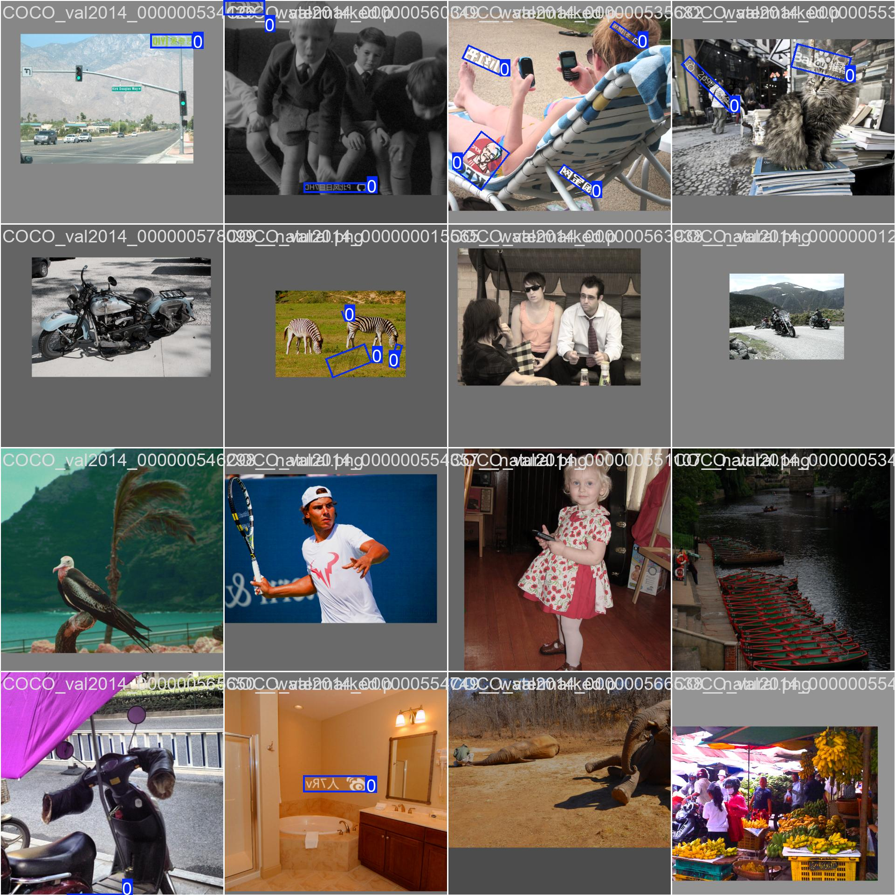
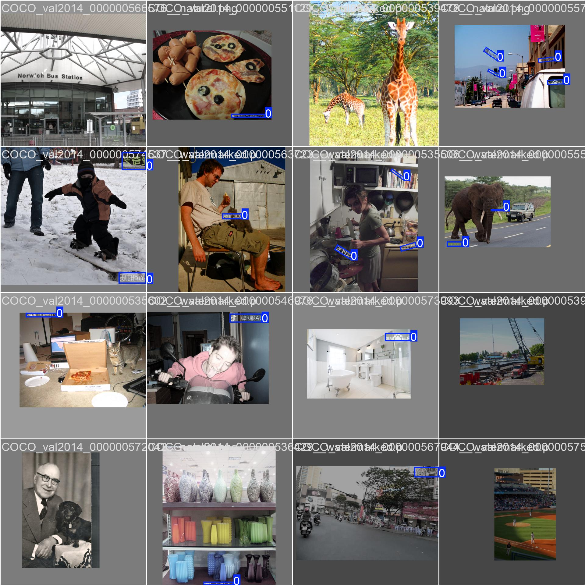
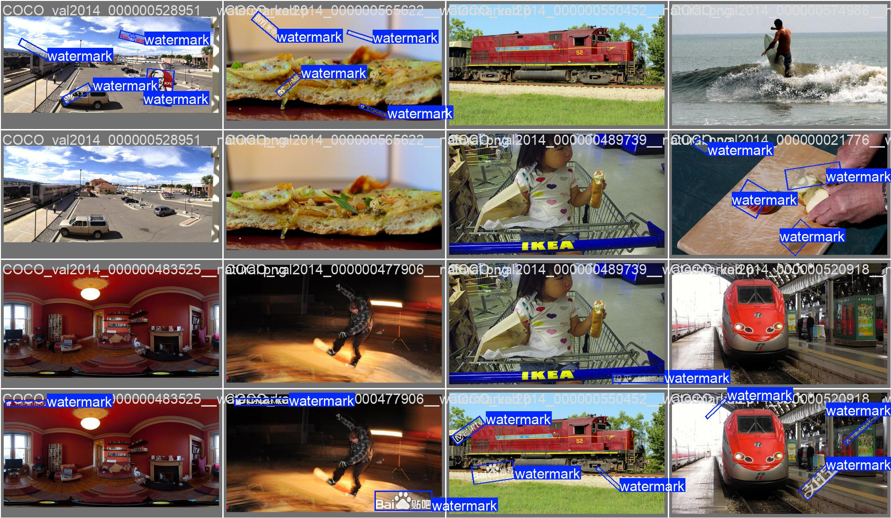
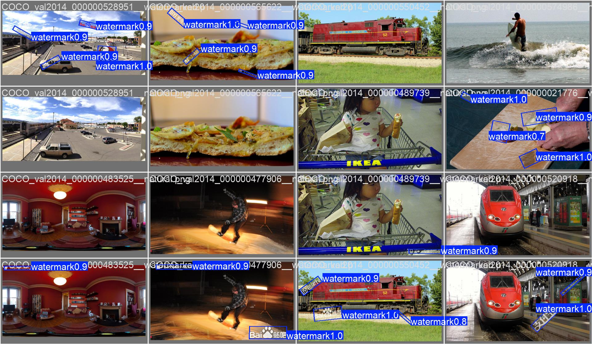
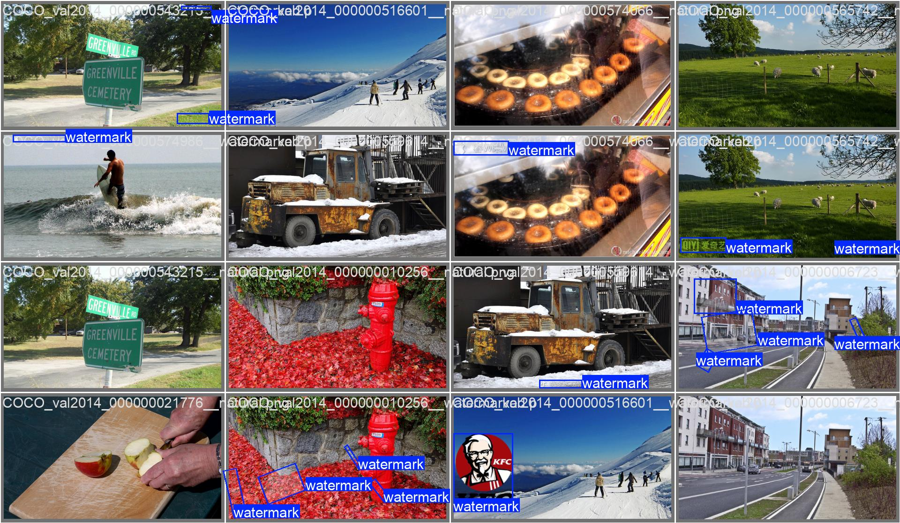
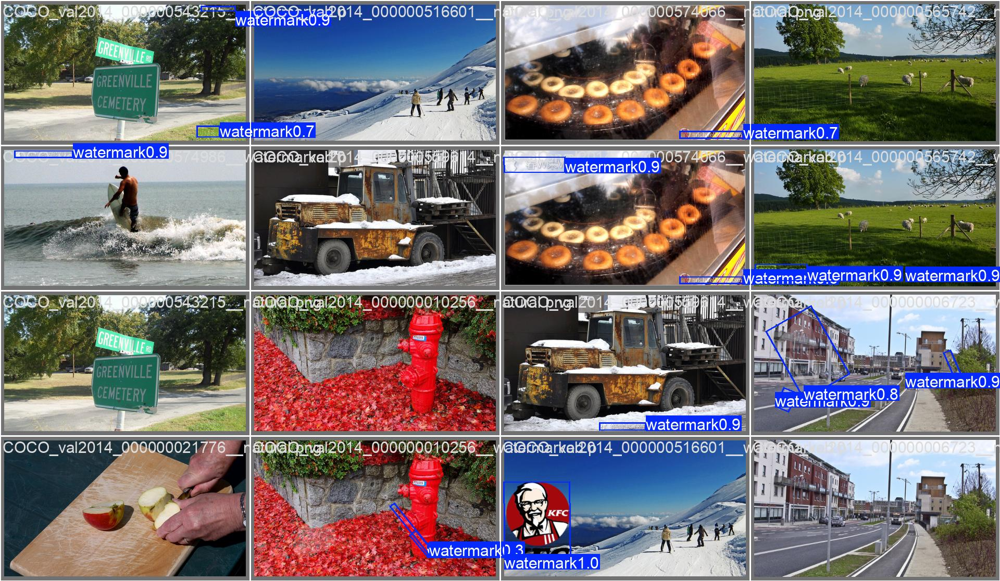

# 可见水印 OBB 检测模型

> 本目录提供可见水印旋转目标框（Oriented Bounding Box，OBB）检测模型的独立 PyTorch 推理、测试、权重转换及 ONNX 导出能力。</br>
> 当前模型的输入仅包含一个类别：`watermark`，即应使用 `Detect` 模型对图像进行一次初筛后，将识别为 `watermark` 的图像再输入当前 `OBB` 模型进行水印识别与标注，以降低算力消耗，最终结果以 `OBB` 模型输出为准。

## 1. 项目状态

- 默认输入尺寸：`960 × 960`，批量大小固定为 `1`。
- 默认推理权重：`weight/best.pt`。
- 支持输入：单张图片或图片文件夹。
- 支持图片格式：JPG、JPEG、PNG、BMP、WebP、TIFF。
- 输出内容：每张图片对应一份 OBB 预测 JSON 和一张绘制旋转框的结果图。
- 推理代码只依赖 PyTorch、OpenCV、NumPy 和 PyYAML；加载兼容权重时不需要安装训练框架。
- 已提供 FP32、FP16、FP8 权重存储量化和 INT8 权重存储量化 ONNX 文件。

## 2. 目录结构

```text
OBB/
├── README.md                  # 本交接文档
├── requirements.txt          # Python 依赖
├── .gitignore                # Git 忽略规则
├── .gitattributes            # 二进制文件属性
├── __init__.py               # Python 包入口
├── config/
│   └── config.yaml           # 推理、测试与导出配置
├── weight/                   # PyTorch、TorchScript、ONNX 权重及校验报告
├── trainResult/              # 训练指标、损失曲线和批次可视化
├── test/
│   ├── input/                # 测试图片
│   └── output/               # 推理结果，不提交到 Git
├── model.py                  # 独立模型结构和权重加载逻辑
├── preprocess.py             # 读图、等比例缩放、填充和张量转换
├── postprocess.py            # 置信度过滤、旋转框 NMS 和坐标转换
├── pipeline.py               # 单图、文件夹及配置化测试接口
├── test_pipeline.py          # 单元测试和测试集批量推理入口
├── convert_checkpoint.py     # 原始权重转独立 TorchScript 权重
└── export_onnx.py            # FP32/FP16/FP8/INT8 ONNX 导出
```

为保持既有调用方兼容，本次没有更改 `pipeline.py`、`config/config.yaml` 等入口路径，也保留了既有的 `trainResult` 和 `Interference` 目录名称。

## 3. 环境安装

建议使用 Python 3.10 或更高版本。进入本目录后执行：

```bash
python -m venv .venv
```

Windows：

```powershell
.venv\Scripts\Activate.ps1
python -m pip install -r requirements.txt
```

Linux/macOS：

```bash
source .venv/bin/activate
python -m pip install -r requirements.txt
```

若仅运行 `.pt` 推理，可以不安装 ONNX 相关依赖；按当前 `requirements.txt` 完整安装可直接使用全部功能。

## 4. 模型输入与输出

### 4.1 输入契约

| 项目 | 说明 |
|---|---|
| 输入名称 | `images`（ONNX） |
| 输入形状 | `[1, 3, 960, 960]`，依次为 batch、通道、高、宽 |
| 数据类型 | FP32；PyTorch CUDA 推理可按配置尝试 FP16 |
| 色彩顺序 | RGB |
| 数值范围 | `[0, 1]` |
| 类别 | `0: watermark` |

输入尺寸由 [`config/config.yaml`](config/config.yaml) 中的 `model.input_size` 控制，宽高必须为 32 的正整数倍。当前导出的 ONNX 文件使用固定输入尺寸和固定 batch。

### 4.2 模型原始输出

当前单类别模型的原始输出形状为：

```text
[1, 6, 18900]
```

第二维的 6 个值依次表示：

```text
center_x, center_y, width, height, watermark_score, angle_radians
```

- `18900` 是三个尺度特征图展开后的候选点总数。
- 中心点和宽高位于预处理后的 `960 × 960` 坐标系。
- 角度由模型角度分支给出，模型内部范围约为 `[-π/4, 3π/4]`。
- 原始张量尚未执行阈值过滤、旋转框 NMS 或原图坐标还原，不能直接作为最终标注结果。

### 4.3 最终 JSON 输出

后处理后的 JSON 主要字段如下：

```json
{
  "image": {
    "file_name": "example.jpg",
    "width": 1920,
    "height": 1080
  },
  "annotation_type": "obb_prediction",
  "corner_order": "clockwise",
  "detection_count": 1,
  "watermarks": [
    {
      "id": 0,
      "class_id": 0,
      "class_name": "watermark",
      "confidence": 0.95,
      "obb": {
        "corners_pixel": [[0, 0], [0, 0], [0, 0], [0, 0]],
        "corners_normalized": [[0, 0], [0, 0], [0, 0], [0, 0]],
        "center_pixel": [0, 0],
        "width_pixel": 0,
        "height_pixel": 0,
        "angle_radians": 0,
        "angle_degrees": 0
      },
      "obb_label": [0, 0, 0, 0, 0, 0, 0, 0, 0]
    }
  ]
}
```

其中 `obb_label` 为 `class_id + 4 个归一化角点`，共 9 个数。JSON 还会记录权重路径、运行设备、阈值、缩放比例、填充量和单次模型推理耗时，便于问题追踪。

## 5. 输入预处理

预处理实现在 [`preprocess.py`](preprocess.py)，流程如下：

1. 使用 OpenCV 解码图片，原始内存色彩顺序为 BGR。
2. 按原宽高比缩放到能够完整放入 `960 × 960` 的最大尺寸，不拉伸、不裁剪。
3. 在上下或左右居中填充，默认填充值为 BGR `[114, 114, 114]`。
4. 大图缩小时采用 `INTER_AREA`，小图放大时采用 `INTER_LINEAR`。
5. 将 BGR 转为 RGB，布局从 HWC 转为 CHW，并增加 batch 维。
6. 转为 FP32/FP16，将像素值除以 255，归一化到 `[0, 1]`。

缩放比例为：

```text
scale = min(960 / original_width, 960 / original_height)
```

`preprocess.scale_up: true` 时允许放大小图；设置为 `false` 时小图只进行居中填充。该处理与训练时的等比例缩放加灰边策略保持一致。

## 6. 输出后处理

后处理实现在 [`postprocess.py`](postprocess.py) 和 [`pipeline.py`](pipeline.py)，默认流程如下：

1. 读取类别置信度，过滤 `confidence ≤ 0.25` 的候选框。
2. 若候选过多，仅保留最高分的前 `3000` 个候选。
3. 使用基于概率 IoU 的旋转框 NMS，默认 IoU 阈值为 `0.45`。
4. 每张图片最多保留 `300` 个检测结果。
5. 从中心点、宽、高、角度转换为四个旋转框角点。
6. 减去 Letterbox 填充量并除以缩放比例，将结果映射回原图坐标。
7. 同时生成像素角点、归一化角点、中心点、尺寸和弧度/角度表示。
8. 在原图副本上绘制旋转框、类别名称及置信度。

置信度阈值、NMS 阈值及最大框数量均可在 [`config/config.yaml`](config/config.yaml) 的 `inference` 段修改。真实场景漏检较多时可先降低置信度阈值做召回评估，但正式阈值必须在独立真实验证集上确定。

## 7. 权重文件说明

`weight/` 中的文件如下：

| 文件 | 精度/格式 | 用途与注意事项 |
|---|---|---|
| `best.pt` | PyTorch checkpoint，约 40.50 MiB | 当前默认权重，保留原始模型对象；只加载可信来源的文件 |
| `best_standalone.pt` | TorchScript，约 41.18 MiB | 由 `convert_checkpoint.py` 生成的独立推理权重，适合减少训练框架对象依赖 |
| `best.onnx` | ONNX FP32，约 79.97 MiB | 精度基准及通用部署版本，固定输入 `[1,3,960,960]` |
| `best_fp16.onnx` | ONNX FP16，约 40.08 MiB | FP16 图，输入输出仍保持 FP32；部署端需要支持图中的 FP16 算子 |
| `best_fp8.onnx` | ONNX FP8 E4M3FN 权重，约 20.46 MiB | 逐输出通道权重存储量化，执行时恢复 FP32；不代表原生 FP8 加速 |
| `best_int8.onnx` | ONNX INT8 权重，约 20.44 MiB | 逐输出通道权重存储量化，执行时恢复 FP32；默认优先保证行为稳定 |
| `best*.json` | JSON | 相应导出文件的来源 SHA-256、张量契约、精度模式及数值校验结果 |

注意：

- `best.json` 是 `best.onnx` 的导出报告，不是 `best.pt` 的标签文件。
- 默认 [`config/config.yaml`](config/config.yaml) 仍指向 `best.pt`。如需使用独立 TorchScript 权重，将 `model.weights` 改为 `../weight/best_standalone.pt`。
- 当前推理 Pipeline 加载的是 `.pt`；ONNX 文件用于后续 ONNX Runtime、移动端转换或硬件编译链，不能直接替换 `model.weights`。
- FP8/INT8 默认是权重存储量化而非端到端低精度计算。若将 `export.int8_mode` 改为 `static_qdq`，会使用校准图执行混合静态量化；必须重新评估 mAP 和漏检率。
- GitHub Web 单文件上传限制可能小于这些权重文件。正式仓库建议使用 Git LFS 管理 `*.pt` 和 `*.onnx`，或在 Release 中发布权重并在 README 记录校验值。

重新生成独立权重：

```bash
python convert_checkpoint.py
```

重新导出全部 ONNX 版本：

```bash
python export_onnx.py
```

## 8. 训练结果

本次训练共 60 个周期，总训练时间约 `18144.1 s`（约 5 小时 2 分）。逐周期的训练损失、验证损失、学习率及检测指标均保存在 [`trainResult/results.csv`](trainResult/results.csv)，交接时以该 CSV 为原始记录，不在本文重复列出全部 60 行。

### 8.1 关键指标摘要

| 指标 | 最佳值 | 最佳周期 |
|---|---:|---:|
| Precision | 0.98469 | 30 |
| Recall | 0.95558 | 60 |
| mAP50 | 0.98048 | 40 |
| mAP50-95 | 0.89379 | 60 |

第 60 周期的损失与指标：

| train/box | train/cls | train/dfl | train/angle | val/box | val/cls | val/dfl | val/angle | Precision | Recall | mAP50 | mAP50-95 |
|---:|---:|---:|---:|---:|---:|---:|---:|---:|---:|---:|---:|
| 0.41093 | 0.31891 | 1.01352 | 0.01248 | 0.41423 | 0.32093 | 1.05277 | 0.01842 | 0.97692 | 0.95558 | 0.98012 | 0.89379 |

### 8.2 混淆矩阵

混淆矩阵记录 981 个正确水印检测、53 个背景误检和 38 个水印漏检。该矩阵来自训练流程的验证集统计，不能替代真实业务数据评估。



### 8.3 损失趋势

训练与验证的 box、cls、dfl、angle 损失总体收敛。角度验证损失在后期稳定在约 0.018，训练损失继续下降，部署前仍应关注真实数据上的域差异。



### 8.4 综合训练指标

该图展示损失、Precision、Recall、mAP 和学习率随周期的变化。



### 8.5 训练集标注可视化

以下图片用于快速核对训练样本的 Letterbox、旋转框方向、类别编号和多目标标注是否合理。

| train batch 0 | train batch 1 |
|---|---|
|  |  |

### 8.6 验证集标签与预测可视化

`labels` 为人工/生成标签，`pred` 为模型预测。交接验收时应成对查看，重点关注透明水印、小水印、贴边水印、旋转角度及相邻水印。

| 验证标签 batch 0 | 验证预测 batch 0 |
|---|---|
|  |  |

| 验证标签 batch 1 | 验证预测 batch 1 |
|---|---|
|  |  |

## 9. 测试集与使用方法

### 9.1 测试目录

- `test/input/`：当前包含 40 张合成数据、自然图片和真实来源图片，用于冒烟测试与效果观察。
- `test/output/`：保存推理 JSON 和标注图，属于可重复生成的运行产物，默认不纳入 Git。
- 测试图片仅用于工程验证。上传公开仓库前，应确认所有图片的版权、隐私和数据授权。

每张输入图片会生成：

```text
test/output/<原文件名>.json
test/output/<原文件名>_annotated.<原后缀>
```

### 9.2 使用配置运行全部测试图片

在本目录运行：

```bash
python pipeline.py
```

程序读取 `config.test.input`，并将结果写入 `config.test.output`。是否递归扫描子目录由 `config.test.recursive` 控制。

也可直接调用测试方法：

```python
from test_pipeline import run_configured_input_test

results = run_configured_input_test()
print(f"完成 {len(results)} 张图片")
```

### 9.3 单张图片推理

```python
from pipeline import OBBInferencePipeline

detector = OBBInferencePipeline("config/config.yaml")
result = detector.predict_file(
    "test/input/example.jpg",
    output_dir="test/output",
)
print(result["watermarks"])
```

### 9.4 文件夹推理

```python
from pipeline import OBBInferencePipeline

detector = OBBInferencePipeline("config/config.yaml")
results = detector.predict_folder(
    input_dir="path/to/images",
    output_dir="path/to/output",
    recursive=False,
)
```

### 9.5 自动化测试

```bash
python -m unittest test_pipeline.py
```

测试内容包括：权重加载、独立 TorchScript 权重检查、大/小图 Letterbox、旋转框角点转换，以及配置目录下全部测试图片的端到端推理。最后一项会实际覆盖 `test/output/` 中的同名结果，运行时间取决于设备和测试图片数量。

## 10. 配置说明

主要参数位于 [`config/config.yaml`](config/config.yaml)：

| 配置段 | 用途 |
|---|---|
| `model` | 权重路径、设备、输入尺寸、FP16 开关和类别名称 |
| `inference` | 置信度阈值、旋转框 NMS 阈值和最大检测数 |
| `preprocess` | 灰边颜色及是否允许放大小图 |
| `visualization` | 线宽、字体、颜色和 JPEG 质量 |
| `test` | 测试输入、输出路径及递归扫描开关 |
| `export` | ONNX 输出路径、opset、量化模式、校准目录及数值验证阈值 |

相对路径均以 `config/config.yaml` 所在目录为基准，而不是调用程序时的工作目录。

## 11. 潜在问题
1. 当前 OBB 模型在合成水印数据集上表现良好，在已知的数据分布中达到 mAP50-95 ≈ 90% 的成绩，受限于真实数据集数量，但在真实互联网数据中测试仅达到 mAP50-95 ≥ 70%。 
2. 当前版本模型存在未能正确标注识别的水印，包括不限于分布位置不规律水印、占比区域较小水印、重叠水印、透明度过低或过高水印（过高会被认定为字幕而非水印），存在漏检可能，仍需支持最终用户手动添加标记。


## 12. 注意事项
1. 训练/验证指标主要反映当前数据分布；上线前必须使用独立、真实、未参与调参的数据统计 Precision、Recall、mAP 和图片级漏检率。
2. 对于水印检测业务，通常应优先控制漏检。阈值调整必须同时观察误检数量和后续处理成本。
3. FP16、FP8、INT8 文件都需要在目标 NPU/GPU 的实际运行时上验证算子支持、延迟、内存和精度，文件更小不等于推理一定更快。
4. `.pt` 使用基于 pickle 的加载机制，只加载可信权重；移动端优先使用经过目标工具链验证的 ONNX/Core ML/TFLite/厂商格式。
5. 当前模型基于 YoloV11m-OBB 再训练得来，训练环境中使用了 Ultralytics 库及其衍生组件；
6. 考虑到 YoloV11 商业授权条例，正式上线前应开源项目代码，若无法开源则应避免在业务中使用 Ultralytics 相关组件，当前项目中已使用 Torch 重构推理链路，去除了 Ultralytics 相关依赖。

